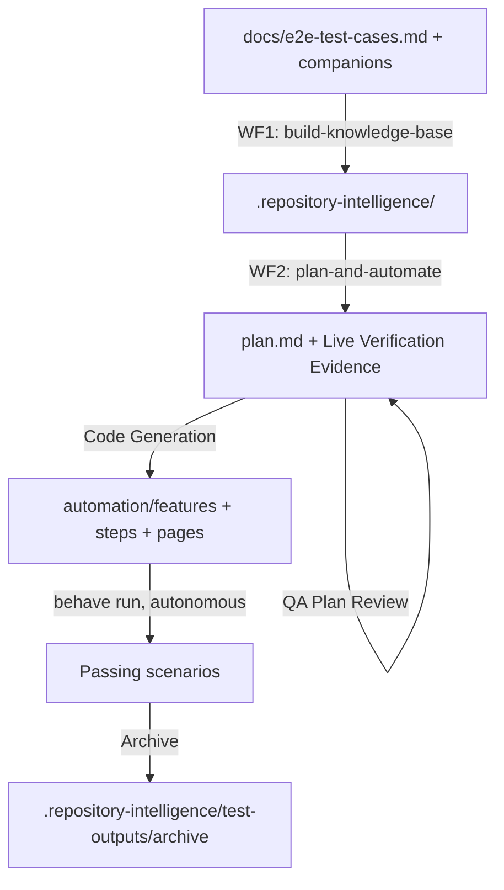

# PostQode AI Automation System — PostQode Nexus

Quick reference for the `.postqode` orchestration engine in this repository. Automates the E2E journeys documented in `docs/e2e-test-cases.md` (+ companions) using **Playwright + Python + behave**, following strict **BDD + Page Object Model (POM) + data-driven** conventions.

No Jira, Xray, Confluence, Oracle, or Java/Maven anywhere in this system.

---

## 1. System Overview

- **Repository Intelligence Layer (RIL):** `.repository-intelligence/` — a knowledge base mapping functional areas to verified locators/flows/patterns, bootstrapped from `docs/*.md` (already Markdown — no parsing step needed).
- **PostQode Engine:** `.postqode/workflows/` + `.postqode/rules/` + `.postqode/skills/` — 2 orchestrator workflows delegating to 10 skills.
- **Automation Project:** `automation/` — standalone Python project (Playwright + behave), no relation to the root `pom.xml` (which remains the Java `backend/` module only).



---

## 2. Two Workflows (not three)

| Workflow | Purpose |
|---|---|
| `01-build-knowledge-base.md` | One-time/periodic: bootstrap the RIL from `docs/*.md`, seeding `component-catalog/` from Appendix A of `e2e-test-cases.md`. |
| `02-plan-and-automate.md` | Per-batch: **merged** ingest → plan → **mandatory live verification** → review → codegen → autonomous run/debug → review → write-back → archive. Replaces the source system's separate WF2 (Architect) + WF3 (Developer) — this project's scope doesn't need two long, separately-gated phases. |

Workflow files are **thin orchestrators** — each phase just names the skill invoked and its gate. All procedure lives in `.postqode/skills/*/SKILL.md`.

---

## 3. Ten Skills

1. `test_case_parser` — parses `docs/e2e-test-cases.md` (+ companions) directly, triages batches, detects pre-existing automation via `@<TEST-ID>` tags.
2. `enrichment_engine` — static enrichment from RIL/existing code, drafts and finalizes `plan.md`.
3. `live_explorer` — **mandatory**, Architect-owned. Runs Playwright+Python scripts to verify every locator/flow live, every batch, regardless of Appendix A.
4. `fixture_resolver` — API-first fixture setup against the Nexus REST API, registry in `reusable-fixtures.json`.
5. `code_generator` — generates `behave` feature files, step defs, Playwright POM page objects, data files; runs `behave` autonomously.
6. `qa_reviewer` — plan review (incl. Live-Verification Evidence Audit) and code review (incl. POM/data-driven compliance).
7. `debugger` — counter-driven escalation ladder for `behave` failures.
8. `archiver` — archives fully implemented, fully verified batches.
9. `batch_cleanup` — redo/cleanup/reconciliation.
10. `ril_writer` — writes verified findings back to the RIL, sanitized.

---

## 4. Automation Stack

| Layer | Choice |
|---|---|
| Browser automation | Playwright for Python (sync API) |
| BDD runner | `behave` |
| Design pattern | Page Object Model — `automation/pages/` |
| Data strategy | Gherkin `Examples:` (simple) + `automation/data/*.json` (larger, via `DataLoader`) |
| Fixture/setup | API-first via `automation/api_clients/` against Nexus's own REST API |
| DB verification | Postgres, read-only (`automation/utils/db_helper.py`) |
| Dependency management | `venv` + `requirements.txt` |
| Browser driver | Playwright's bundled binaries (`playwright install chromium`) |
| Execution | Headless by default, `HEADLESS=false` env var for headed debugging |
| Build/test execution | Autonomous — the agent runs `behave`/`pip install`/`playwright install` itself |

See `.postqode/rules/automation-framework.md` for full conventions.

---

## 5. Running a Batch

```
"Automate AUTH-E2E-001 through AUTH-E2E-005"
```
This triggers `02-plan-and-automate.md` Mode A: ingest → plan → mandatory Playwright verification → plan finalize → QA review → codegen → `behave` run (autonomous) → debug loop if needed → code review → RIL write-back → archive.

```
"Answers for batch-001: 1. ..."
```
Mode B — resumes at Phase 4 with the user's answer to a previously-raised Open Question.

```
"Redo batch-001"
```
Mode D — delegates to `batch_cleanup`.

```
"Cleanup / reconcile"
```
Mode E — delegates to `batch_cleanup`.

---

## 6. Directory Reference

```
.postqode/
├── README.md
├── rules/                  # general-conventions, automation-framework, batch-schema,
│                           #  companion-communication, lessons-learned, fixture-api-rules
├── workflows/
│   ├── 01-build-knowledge-base.md
│   └── 02-plan-and-automate.md
└── skills/
    ├── test_case_parser/
    ├── enrichment_engine/
    ├── live_explorer/
    ├── fixture_resolver/
    ├── code_generator/
    ├── qa_reviewer/
    ├── debugger/
    ├── archiver/
    ├── batch_cleanup/
    └── ril_writer/

.repository-intelligence/    # RIL — bootstrapped by WF1
automation/                  # Playwright + Python + behave project
brain/scripts/                # mandatory live-verification scripts (Architect-owned)
```
