# PostQode Nexus – Implementation Plan

## Document Info
| Field | Value |
|-------|-------|
| Version | v1.0 |
| Status | Draft |
| Based On | Requirement Document v1.0 |
| Created | 2026-01-08 |

---

## 1. Executive Summary

This document outlines the complete implementation plan for **PostQode Nexus**, a CI/CD-ready demo application for the Inventory & Product Management domain. The plan covers architecture, development phases, technical specifications, and deployment strategy.

---

## 1.1 Testing Philosophy

> **Quality at Every Phase**: Testing is not a final phase — it's integrated into every development stage.

### Testing Pyramid

```
                    ┌─────────────────┐
                    │   E2E / Manual  │  ← Demo Flows
                    │    (Slowest)    │
                   ─┴─────────────────┴─
                  ┌─────────────────────┐
                  │  Integration Tests  │  ← API + DB
                  │    (Medium Speed)   │
                 ─┴─────────────────────┴─
                ┌─────────────────────────┐
                │      Unit Tests         │  ← Business Logic
                │      (Fastest)          │
                └─────────────────────────┘
```

### Testing Types by Layer

| Test Type | Where | Tools | When Run |
|-----------|-------|-------|----------|
| **Unit Tests** | Backend services, Frontend components | JUnit, Vitest | Every commit |
| **Integration Tests** | API endpoints, DB operations | REST Assured, Testcontainers | Every PR |
| **Contract Tests** | API contracts (REST/GraphQL) | Pact, Apollo | Every PR |
| **UI Component Tests** | React components | Testing Library | Every commit |
| **E2E Tests** | User flows | Playwright | Pre-deploy |
| **Manual Testing** | User experience, visual | Human | Each phase |

### Manual Testing Strategy

Each development phase includes **Manual Testing Checkpoints** with:
- ✅ **Acceptance Criteria** — What must work
- 🧪 **Test Steps** — Exact steps to verify
- 📋 **Sign-off Checklist** — Before moving to next phase

---

## 1.2 Design System: shadcn/ui

> **Why shadcn/ui?**: Accessible, customizable, automation-friendly components with stable IDs.

### Selected Components

| Component | Usage | Screen |
|-----------|-------|--------|
| `button` | All actions (Submit, Add, Edit, Delete) | All |
| `input` | Text inputs (username, password, search) | Login, Catalog, Inventory |
| `form` + `field` | Form validation and structure | Login, Product Form |
| `table` | Product listing | Catalog |
| `card` | Dashboard metrics | Dashboard |
| `chart` | Analytics visualizations | Dashboard |
| `dialog` | Add/Edit product modals | Inventory |
| `alert-dialog` | Delete confirmation | Inventory |
| `dropdown-menu` | Actions menu, User menu | Catalog, Header |
| `select` | Status filter, Status change | Catalog, Inventory |
| `pagination` | Product list pagination | Catalog |
| `badge` | Status indicators | Catalog |
| `sidebar` | Main navigation | All |
| `sonner` | Toast notifications | All |
| `skeleton` | Loading states | All |
| `avatar` | User profile | Header |
| `separator` | Visual dividers | All |

### Installation Command

```bash
npx shadcn@latest init
npx shadcn@latest add button input form table card chart dialog alert-dialog dropdown-menu select pagination badge sidebar sonner skeleton avatar separator
```

### Automation-Friendly Benefits

- **Stable IDs**: Components support `id` and `data-testid` attributes
- **Consistent Structure**: Predictable DOM hierarchy
- **Accessible**: Built-in ARIA labels and keyboard navigation

---

## 2. Project Structure

```
postqode-nexus/
├── docs/                          # Documentation
│   ├── requirement document.md
│   ├── implementation-plan.md
│   └── api-contracts/
│       ├── rest-api.yaml
│       └── graphql-schema.graphql
├── backend/                       # Java Spring Boot
│   ├── src/
│   │   ├── main/
│   │   │   ├── java/com/postqode/nexus/
│   │   │   │   ├── NexusApplication.java
│   │   │   │   ├── config/
│   │   │   │   ├── controller/
│   │   │   │   ├── service/
│   │   │   │   ├── repository/
│   │   │   │   ├── model/
│   │   │   │   ├── dto/
│   │   │   │   ├── graphql/
│   │   │   │   └── security/
│   │   │   └── resources/
│   │   │       ├── application.yml
│   │   │       ├── application-dev.yml
│   │   │       ├── application-demo.yml
│   │   │       └── db/migration/
│   │   └── test/
│   ├── Dockerfile
│   └── pom.xml
├── frontend/                      # React Web App
│   ├── src/
│   │   ├── components/
│   │   ├── pages/
│   │   ├── services/
│   │   ├── hooks/
│   │   ├── context/
│   │   ├── utils/
│   │   └── App.tsx
│   ├── public/
│   ├── Dockerfile
│   ├── package.json
│   └── vite.config.ts
├── mobile/                        # React Native App
│   ├── src/
│   │   ├── components/
│   │   ├── screens/
│   │   ├── services/
│   │   ├── navigation/
│   │   └── App.tsx
│   ├── android/
│   ├── ios/
│   └── package.json
├── database/                      # Database Scripts
│   ├── migrations/
│   ├── seeds/
│   └── reset-demo.sh
├── automation/                    # Test Automation
│   ├── api-tests/
│   ├── ui-tests/
│   └── smoke-tests/
├── docker/
│   ├── docker-compose.yml
│   ├── docker-compose.dev.yml
│   └── docker-compose.demo.yml
├── .github/
│   └── workflows/
│       ├── ci.yml
│       ├── cd-demo.yml
│       └── cd-prod-demo.yml
├── scripts/
│   ├── setup.sh
│   ├── build.sh
│   └── deploy.sh
├── .env.example
└── README.md
```

---

## 3. Development Phases

> **📄 Functional Reference**: [Application Functionality Document](./application-functionality.md)
> 
> Each phase below links to specific sections in the functionality document. Refer to these for detailed UI layouts, user interactions, validation rules, and business logic.

---

### ✅ Phase 1: Foundation (Week 1-2)

| Task | Description | Deliverables | Status |
|------|-------------|--------------|--------|
| 1.1 | Repository setup | Git repo, branch strategy, README | ✅ |
| 1.2 | Backend scaffold | Spring Boot project with Maven | ✅ |
| 1.3 | Frontend scaffold | React + Vite + TypeScript project | ✅ |
| 1.4 | Mobile scaffold | React Native project | ✅ |
| 1.5 | Database setup | PostgreSQL schema, Flyway migrations | ✅ |
| 1.6 | Docker configuration | Dockerfiles, docker-compose.yml | ✅ |
| 1.7 | Setup scripts | scripts/setup.sh, scripts/reset-demo.sh | ✅ |
| 1.8 | Documentation | Development guide, Testing guide | ✅ |

**Functional References:**
- [User Roles & Permissions](./application-functionality.md#2-user-roles--permissions) – Understand role structure for RBAC setup
- [Data Models](./application-functionality.md#6-data-models) – Entity definitions for database schema
- [Business Rules](./application-functionality.md#7-business-rules) – Constraints and validation logic

**📝 Documentation Updates:**
- [ ] Create/Update [Development Guide](./development-guide.md) with setup instructions
- [ ] Create/Update [Testing Guide](./testing-guide.md) with Phase 1 tests


#### 🧪 Phase 1 Testing

| Test Type | Test | Command/Steps |
|-----------|------|---------------|
| Unit | Spring Boot context loads | `cd backend && mvn test` |
| Unit | Flyway migrations run | `mvn flyway:migrate` |
| Unit | Frontend builds | `cd frontend && npm run build` |
| Integration | Docker Compose starts | `docker-compose up -d && docker-compose ps` |
| Integration | Database connection | `docker exec nexus-db psql -U nexus -c 'SELECT 1'` |

#### ✅ Phase 1 Manual Testing Checklist

| # | Test | Steps | Expected Result |
|---|------|-------|----------------|
| 1 | Repo structure | Run `ls -la` in project root | All folders exist (backend, frontend, mobile, docs) |
| 2 | Backend starts | Run `cd backend && mvn spring-boot:run` | Server starts on port 8080 |
| 3 | Frontend starts | Run `cd frontend && npm run dev` | Vite server starts on port 5173 |
| 4 | DB accessible | Connect with pgAdmin or `psql` | Tables created via migration |
| 5 | Docker works | Run `docker-compose up -d` | All 3 containers healthy |

**Sign-off**: [x] All tests passing — Ready for Phase 2

---

### ✅ Phase 2: Core Backend (Week 3-4)

| Task | Description | Deliverables | Functional Reference | Status |
|------|-------------|--------------|---------------------|--------|
| 2.1 | Authentication API | JWT login/logout endpoints | [Login Screen](./application-functionality.md#41-login-screen) | ✅ |
| 2.2 | User management | User entity, roles, RBAC | [User Roles & Permissions](./application-functionality.md#2-user-roles--permissions) | ✅ |
| 2.3 | Product CRUD API | REST endpoints for products | [Inventory Management](./application-functionality.md#43-inventory-management-admin-only) | ✅ |
| 2.4 | Inventory management | State transitions, audit logging | [Change Product Status](./application-functionality.md#434-change-product-status) | ✅ |
| 2.5 | GraphQL setup | Schema, resolvers, queries | [Dashboard Components](./application-functionality.md#44-dashboard-screen-admin-only) | ✅ |
| 2.6 | Dashboard analytics API | Metrics endpoints | [Dashboard Screen](./application-functionality.md#44-dashboard-screen-admin-only) | ✅ |

**Detailed Functional Specs:**
- **Authentication**: See [Login Screen - Validation Rules](./application-functionality.md#41-login-screen) for field validation and error messages
- **Product Status Logic**: See [Status Indicators](./application-functionality.md#status-indicators) for auto-status rules
- **Activity Logging**: See [Audit Rules](./application-functionality.md#73-audit-rules) for what to log

#### 🧪 Phase 2 Testing

| Test Type | Test | Command/Steps |
|-----------|------|---------------|
| Unit | AuthService tests | `cd backend && mvn test -Dtest=AuthServiceTest` |
| Unit | ProductService tests | `cd backend && mvn test -Dtest=ProductServiceTest` |
| Unit | User role validation | `mvn test -Dtest=RoleValidationTest` |
| Integration | Auth API endpoints | `mvn test -Dtest=AuthControllerIT` |
| Integration | Product CRUD API | `mvn test -Dtest=ProductControllerIT` |
| Contract | REST API contracts | `mvn test -Dtest=ApiContractTest` |
| Contract | GraphQL schema | `mvn test -Dtest=GraphQLSchemaTest` |

#### ✅ Phase 2 Manual Testing Checklist

| # | Test | Steps | Expected Result |
|---|------|-------|----------------|
| 1 | Login API | POST `/api/v1/auth/login` with valid creds | Returns JWT token |
| 2 | Login fail | POST `/api/v1/auth/login` with invalid creds | Returns 401 error |
| 3 | Get products | GET `/api/v1/products` with token | Returns product list |
| 4 | Create product | POST `/api/v1/products` as Admin | Product created, 201 |
| 5 | Create product (User) | POST `/api/v1/products` as User | 403 Forbidden |
| 6 | Update status | PATCH `/api/v1/products/{id}/status` | Status changed, logged |
| 7 | GraphQL query | POST `/graphql` with products query | Returns data |
| 8 | Dashboard metrics | Query `dashboardMetrics` | Returns counts |

**Sign-off**: [x] All tests passing — Ready for Phase 2.1

---

### ✅ Phase 2.1: API Documentation & Dev Tools (Week 4)

> **📝 Documentation**: This phase enables interactive API testing via Swagger UI and provides scripts for starting services.

| Task | Description | Deliverables | Status |
|------|-------------|--------------|--------|
| 2.1.1 | Add springdoc-openapi | Maven dependency added | ✅ |
| 2.1.2 | Configure Swagger UI | OpenAPI 3.0 config | ✅ |
| 2.1.3 | Annotate controllers | @Operation, @ApiResponse | ✅ |
| 2.1.4 | Secure Swagger UI | JWT authentication | ✅ |
| 2.1.5 | Create startup scripts | start-dev.sh, start-all.sh, etc. | ✅ |
| 2.1.6 | Update security config | Allow /swagger-ui/** endpoints | ✅ |
| 2.1.7 | Update docs | Update development & testing guides | ✅ |

**Startup Scripts Created:**
| Script | Purpose |
|--------|---------|
| `scripts/start-dev.sh` | Start DB + Backend + Frontend locally |
| `scripts/stop-dev.sh` | Stop all local services |
| `scripts/start-backend.sh` | Start backend only |
| `scripts/start-frontend.sh` | Start frontend only |
| `scripts/start-all.sh` | Start all via Docker Compose |
| `scripts/stop-all.sh` | Stop all Docker Compose services |

**Backend Dependency (already added):**
```xml
<dependency>
    <groupId>org.springdoc</groupId>
    <artifactId>springdoc-openapi-starter-webmvc-ui</artifactId>
    <version>2.3.0</version>
</dependency>
```

**Access URLs:**
- Swagger UI: `http://localhost:8080/swagger-ui.html`
- OpenAPI JSON: `http://localhost:8080/v3/api-docs`

#### 🧪 Phase 2.1 Testing

| Test Type | Test | Command/Steps |
|-----------|------|---------------|
| Script | start-dev.sh works | `./scripts/start-dev.sh` |
| Script | start-all.sh works | `./scripts/start-all.sh` |
| Manual | Swagger UI loads | Visit `/swagger-ui.html` |
| Manual | Auth endpoint visible | Expand `/api/v1/auth` |
| Manual | Try login | Execute login, get token |
| Manual | Authorize | Click Authorize, paste token |
| Manual | Try products | Execute GET products |

#### ✅ Phase 2.1 Manual Testing Checklist

| # | Test | Steps | Expected Result | Status |
|---|------|-------|----------------|--------|
| 1 | Dev startup | Run `./scripts/start-dev.sh` | All services start | ✅ |
| 2 | Backend accessible | Visit `http://localhost:8080/health` | Returns UP | ✅ |
| 3 | Swagger loads | Visit `http://localhost:8080/swagger-ui.html` | API docs page | ✅ |
| 4 | Endpoints listed | Check page content | All controllers visible | ✅ |
| 5 | Login works | Try POST /auth/login | Token returned | ✅ |
| 6 | Authorization | Click Authorize, paste Bearer token | 🔒 icon shown | ✅ |
| 7 | Protected APIs | Try GET /products | Returns data | ✅ |

| 8 | Stop dev | Run `./scripts/stop-dev.sh` | Services stopped | ✅ |

**📝 Documentation Updates:**
- [x] Update [Development Guide](./development-guide.md) with script usage
- [x] Update [Testing Guide](./testing-guide.md) with Swagger instructions

**Sign-off**: [x] All tests passing — Ready for Phase 3

---

### ✅ Phase 3: Frontend Development (Week 5-6)

| Task | Description | Deliverables | Functional Reference |
|------|-------------|--------------|---------------------|
| 3.1 | Design system | Colors, typography, components | [Status Indicators](./application-functionality.md#status-indicators) | ✅ |
| 3.2 | Login screen | Auth flow, error handling | [Login Screen](./application-functionality.md#41-login-screen) | ✅ |
| 3.3 | Product catalog | List, search, sort, filter, pagination | [Product Catalog](./application-functionality.md#42-product-catalog-screen) | ✅ |
| 3.4 | Inventory management | Admin CRUD interface | [Inventory Management](./application-functionality.md#43-inventory-management-admin-only) | ✅ |
| 3.5 | Dashboard | Charts, real-time metrics | [Dashboard Screen](./application-functionality.md#44-dashboard-screen-admin-only) | ✅ |
| 3.6 | Navigation & routing | Protected routes, role-based UI | [Navigation Structure](./application-functionality.md#5-navigation-structure) | ✅ |

**Detailed Functional Specs:**

#### 3.2 Login Screen Implementation
- **Layout**: [Login Screen Layout](./application-functionality.md#layout)
- **Form Fields**: [Functionality Table](./application-functionality.md#functionality)
- **Validation**: [Validation Rules](./application-functionality.md#validation-rules)
- **Error Messages**: [Error Messages](./application-functionality.md#error-messages)
- **Success Behavior**: [Success Behavior](./application-functionality.md#success-behavior)

#### 3.3 Product Catalog Implementation
- **Layout**: [Product Catalog Layout](./application-functionality.md#layout-1)
- **Table Columns**: [Product Table Columns](./application-functionality.md#product-table-columns)
- **Search Behavior**: [Search Behavior](./application-functionality.md#search-behavior)
- **Filter Options**: [Filter Options](./application-functionality.md#filter-options)
- **Sort Options**: [Sort Options](./application-functionality.md#sort-options)
- **Pagination**: [Pagination](./application-functionality.md#pagination)

#### 3.4 Inventory Management Implementation
- **Add Product Modal**: [Add Product Modal](./application-functionality.md#431-add-product-modal)
- **Edit Product Modal**: [Edit Product Modal](./application-functionality.md#432-edit-product-modal)
- **Delete Product**: [Delete Product](./application-functionality.md#433-delete-product)
- **Change Status**: [Change Product Status](./application-functionality.md#434-change-product-status)

#### 3.5 Dashboard Implementation
- **Summary Cards**: [Summary Cards](./application-functionality.md#441-summary-cards)
- **Status Pie Chart**: [Products by Status](./application-functionality.md#442-products-by-status-pie-chart)
- **Products Added Today**: [Products Added Today](./application-functionality.md#443-products-added-today)
- **Activity by User**: [Activity by User](./application-functionality.md#444-activity-by-user)
- **Recent Activity Feed**: [Recent Activity Feed](./application-functionality.md#445-recent-activity-feed)

#### 🎨 shadcn/ui Components for Phase 3

| Screen | Components |
|--------|------------|
| Login | `form`, `input`, `button`, `card` |
| Catalog | `table`, `input`, `select`, `badge`, `pagination`, `dropdown-menu` |
| Inventory | `dialog`, `alert-dialog`, `form`, `input`, `select`, `button` |
| Dashboard | `card`, `chart`, `badge`, `skeleton` |
| Navigation | `sidebar`, `avatar`, `dropdown-menu`, `separator` |
| Global | `sonner` (toasts), `skeleton` (loading) |

#### 🧪 Phase 3 Testing

| Test Type | Test | Command/Steps |
|-----------|------|---------------|
| Unit | Component tests | `cd frontend && npm run test` |
| Unit | LoginForm validation | `npm run test -- LoginForm` |
| Unit | ProductTable rendering | `npm run test -- ProductTable` |
| E2E | Login flow | `npx playwright test login.spec.ts` |
| E2E | Product CRUD | `npx playwright test products.spec.ts` |
| Visual | UI screenshots | `npx playwright test --update-snapshots` |

#### ✅ Phase 3 Manual Testing Checklist

| # | Test | Steps | Expected Result |
|---|------|-------|----------------|
| 1 | Login success | Enter admin/Admin@123, click Login | Redirects to catalog |
| 2 | Login failure | Enter wrong password | Shows error message |
| 3 | View catalog | After login, view product list | Table shows products |
| 4 | Search | Type in search box | Table filters in real-time |
| 5 | Filter status | Select "Low Stock" filter | Only low stock shown |
| 6 | Sort | Click column header | Table sorts |
| 7 | Pagination | Click page 2 | Shows next 10 products |
| 8 | Add product | Click Add, fill form, Save | Product appears in list |
| 9 | Edit product | Click Edit, change name, Save | Name updated |
| 10 | Delete product | Click Delete, Confirm | Product removed |
| 11 | Change status | Change status dropdown | Status badge updates |
| 12 | Dashboard metrics | Navigate to Dashboard | Cards show correct counts |
| 13 | Dashboard charts | View pie/bar charts | Charts render correctly |
| 14 | Logout | Click Logout | Returns to login page |
| 15 | Role restriction | Login as User, try to add product | Add button not visible |

**Sign-off**: [x] All tests passing — Ready for Phase 4

---

### Phase 3.1: Enhanced Functionality (Week 6-7)

| Task | Description | Deliverables | Functional Reference |
|------|-------------|--------------|---------------------|
| 3.1.1 | Database Enhancements | Schema for Categories, Orders, User status | [Data Models](./application-functionality.md#6-data-models) |
| 3.1.2 | Feature: Category Management | Backend API + Admin UI | [Category Management](./application-functionality.md#46-category-management-admin-only) |
| 3.1.3 | Feature: User Management | Backend API + Admin UI | [User Management](./application-functionality.md#47-user-management-admin-only) |
| 3.1.4 | Feature: Order System | Backend API + User/Admin UI | [Order Management](./application-functionality.md#48-order-management) |
| 3.1.5 | Feature: User Inventory | Backend API + User UI (CRUD) | [My Inventory](./application-functionality.md#49-my-inventory-user) |
| 3.1.6 | Product Catalog Refactor | Categorized view, Order integration | [Product Catalog Screen](./application-functionality.md#42-product-catalog-screen) |

**Detailed Functional Specs:**

#### 3.1.1 Category Management
- **Components**: List, Add Modal, Edit Modal, Delete confirmation.
- **Rules**: Products can trigger category creation or mapping.

#### 3.1.2 User Management
- **Components**: User table, Enable/Disable toggle, Add/Edit User modal.
- **Security**: Admin only access.

#### 3.1.3 Order System
- **User**: "Buy" action on product -> "My Orders" screen.
- **Admin**: "Order Management" screen -> Approve/Reject.
- **Logic**: Stock reduction only on approval.

#### 3.1.5 User Inventory
- **Components**: "My Inventory" Page, Add/Edit Item Modal.
- **Integration**: Auto-add approved order items.
- **Actions**: CRUD (Create, Read, Update, Delete).

#### 🧪 Phase 3.1 Testing

| Test Type | Test | Command/Steps |
|-----------|------|---------------|
| Unit | Order Service logic | `mvn test -Dtest=OrderServiceTest` |
| Unit | Category Service logic | `mvn test -Dtest=CategoryServiceTest` |
| E2E | Full Order Flow | `npx playwright test order-flow.spec.ts` |
| E2E | Admin Category/User | `npx playwright test admin-features.spec.ts` |

#### Low-Level Manual Testing Checklist

| # | Test | Steps | Expected Result |
|---|------|-------|----------------|
| 1 | Create Category | Admin > Categories > Add | Category appears |
| 2 | Assign Category | Edit Product > Select Category | Saved correctly |
| 3 | Filter by Category| Catalog > Select Category | Filters list |
| 4 | Create User | Admin > Users > Add | User created |
| 5 | Disable User | Admin > Users > Toggle | User cannot login |
| 6 | Place Order | User > Buy Product | Order stats "Pending" |
| 7 | Approve Order | Admin > Orders > Approve | Stock reduced, Added to User Inv |
| 8 | Reject Order | Admin > Orders > Reject | Stock unchanged |
| 9 | My Inventory | User > My Inventory | Shows Purchased Items |
| 10 | Edit Owned Item | User > My Inventory > Edit | Updates Detail |
| 11 | Add Personal Item | User > My Inventory > Add | Adds New Item |

**Sign-off**: [x] All tests passing — ✅ Phase 3.1 Complete (2026-01-09)

---

### Phase 4: Mobile Development (Week 7-8)

| Task | Description | Deliverables | Functional Reference |
|------|-------------|--------------|---------------------|
| 4.1 | Mobile design adaptation | Responsive components | [Responsive Behavior](./application-functionality.md#10-responsive-behavior) |
| 4.2 | Authentication | Login/logout flow | [Login Screen](./application-functionality.md#41-login-screen) |
| 4.3 | Product catalog | Native list components | [Product Catalog](./application-functionality.md#42-product-catalog-screen) |
| 4.4 | Inventory management | Admin features | [Inventory Management](./application-functionality.md#43-inventory-management-admin-only) |
| 4.5 | Dashboard | Mobile-optimized charts | [Dashboard Screen](./application-functionality.md#44-dashboard-screen-admin-only) |
| 4.6 | Navigation | Stack/tab navigation | [Bottom Navigation (Mobile)](./application-functionality.md#52-bottom-navigation-mobile) |
| 4.7 | Mobile startup script | scripts/start-mobile.sh | – |
| 4.8 | Mobile: Category/User | Admin mobile features | [Category Management](./application-functionality.md#46-category-management-admin-only) |
| 4.9 | Mobile: Orders & Inventory | User mobile features | [My Inventory](./application-functionality.md#49-my-inventory-user) |

**Mobile-Specific References:**
- **Breakpoints**: [Breakpoints](./application-functionality.md#101-breakpoints)
- **Component Adaptations**: [Component Adaptations](./application-functionality.md#102-component-adaptations)

#### 🧪 Phase 4 Testing

| Test Type | Test | Command/Steps |
|-----------|------|---------------|
| Unit | Component tests | `cd mobile && npm run test` |
| Unit | Navigation tests | `npm run test -- Navigation` |
| Integration | API integration | `npm run test:integration` |
| E2E (Android) | Full flow | `npx detox test -c android.emu.debug` |
| E2E (iOS) | Full flow | `npx detox test -c ios.sim.debug` |

#### ✅ Phase 4 Manual Testing Checklist

| # | Test | Device | Steps | Expected Result |
|---|------|--------|-------|----------------|
| 1 | Login | Android | Enter creds, tap Login | Goes to catalog |
| 2 | Login | iOS | Enter creds, tap Login | Goes to catalog |
| 3 | Catalog scroll | Both | Scroll product list | Smooth scrolling |
| 4 | Search | Both | Type in search | Filters products |
| 5 | Add product | Android | Tap +, fill form, Save | Product added |
| 6 | Add product | iOS | Tap +, fill form, Save | Product added |
| 7 | Dashboard | Both | View charts | Charts render |
| 8 | Navigation | Both | Switch between tabs | Correct screens |
| 9 | Offline | Both | Turn off network | Graceful error |
| 10 | Web parity | Both | Compare with web | Same functionality |
| 11 | Place Order | Mobile | Add to cart, checkout | Order created |
| 12 | My Inventory | Mobile | View owned items | List displayed |

**Sign-off**: [ ] All tests passing — Ready for Phase 5

---

### Phase 5: CI/CD & DevOps (Week 9)

| Task | Description | Deliverables |
|------|-------------|--------------|
| 5.1 | CI pipeline | GitHub Actions workflow |
| 5.2 | Docker builds | Multi-stage, optimized images |
| 5.3 | CD pipelines | Deploy to demo/prod-demo |
| 5.4 | Environment configs | .env files per environment |
| 5.5 | Health checks | /health, /readiness, /version |
| 5.6 | CI/CD scripts | scripts/build.sh, scripts/deploy.sh |

**Functional Reference:**
- [Logout - Session Timeout](./application-functionality.md#session-timeout) – Token expiry configuration

#### 🧪 Phase 5 Testing

| Test Type | Test | Command/Steps |
|-----------|------|---------------|
| Integration | CI builds pass | Push to branch, check GitHub Actions |
| Integration | Docker images build | `docker-compose build` |
| Integration | Multi-env deploy | Deploy to dev, then demo |
| Health | Health endpoints | `curl http://localhost:8080/health` |
| Health | Readiness probe | `curl http://localhost:8080/readiness` |
| Smoke | Post-deploy smoke | `npm run test:smoke` |

#### ✅ Phase 5 Manual Testing Checklist

| # | Test | Steps | Expected Result |
|---|------|-------|----------------|
| 1 | CI triggers | Push commit to main | GitHub Action runs |
| 2 | CI passes | Check Actions tab | All jobs green |
| 3 | Docker build | Run `docker-compose build` | Images created |
| 4 | Docker run | Run `docker-compose up -d` | Containers healthy |
| 5 | Health check | Visit `/health` | Returns `{"status": "UP"}` |
| 6 | Readiness | Visit `/readiness` | Returns 200 |
| 7 | Version | Visit `/version` | Returns version info |
| 8 | Demo deploy | Deploy to demo env | App accessible |
| 9 | Rollback | Rollback to prev image | App still works |

**Sign-off**: [ ] All tests passing — Ready for Phase 6

---

### Phase 6: Testing & Automation (Week 10)

| Task | Description | Deliverables | Functional Reference |
|------|-------------|--------------|---------------------|
| 6.1 | Backend unit tests | JUnit tests, 80%+ coverage | [Business Rules](./application-functionality.md#7-business-rules) |
| 6.2 | API contract tests | REST & GraphQL validation | [Data Models](./application-functionality.md#6-data-models) |
| 6.3 | UI smoke tests | Critical path automation | [Demo Scenarios](./application-functionality.md#12-demo-scenarios) |
| 6.4 | Mobile tests | Cross-platform validation | [Responsive Behavior](./application-functionality.md#10-responsive-behavior) |
| 6.5 | Demo reset scripts | Improve reset-demo.sh for automation | [Demo Data Set](./application-functionality.md#13-demo-data-set) |
| 6.6 | Update scripts README | Add new scripts to README.md | – |

**Test Scenarios:**
- **Admin Flow**: [Admin Demo Flow (5 minutes)](./application-functionality.md#121-admin-demo-flow-5-minutes)
- **User Flow**: [User Demo Flow (3 minutes)](./application-functionality.md#122-user-demo-flow-3-minutes)
- **Order Flow**: Verify stock reduction logic and inventory syncing

#### 🧪 Phase 6 Testing (Meta-Testing)

| Test Type | Test | Command/Steps |
|-----------|------|---------------|
| Coverage | Backend coverage | `mvn jacoco:report` (target 80%) |
| Coverage | Frontend coverage | `npm run test:coverage` (target 70%) |
| E2E Suite | Full regression | `npx playwright test` |
| E2E Suite | Mobile regression | `npx detox test --configuration release` |
| API Suite | Contract validation | `npm run test:contracts` |
| Reset | Demo reset script | `./scripts/reset-demo.sh` |

#### ✅ Phase 6 Manual Testing Checklist

| # | Test | Steps | Expected Result |
|---|------|-------|----------------|
| 1 | Coverage report | Run coverage commands | Meets thresholds |
| 2 | Admin demo flow | Follow [Admin Demo Flow](./application-functionality.md#121-admin-demo-flow-5-minutes) | Completes in 5 min |
| 3 | User demo flow | Follow [User Demo Flow](./application-functionality.md#122-user-demo-flow-3-minutes) | Completes in 3 min |
| 4 | Reset script | Run `./reset-demo.sh` | Data reset, app works |
| 5 | Cross-browser | Test in Chrome, Firefox, Safari | All work |
| 6 | Responsive | Test at mobile breakpoints | UI adapts correctly |
| 7 | Accessibility | Run Lighthouse audit | Score > 90 |

**Sign-off**: [ ] All tests passing — Ready for Phase 7

---

### Phase 7: Polish & Documentation (Week 11-12)

| Task | Description | Deliverables | Functional Reference |
|------|-------------|--------------|---------------------|
| 7.1 | UI/UX polish | Animations, feedback, consistency | [Notifications](./application-functionality.md#9-notifications) |
| 7.2 | Demo scripts | Step-by-step guides | [Demo Scenarios](./application-functionality.md#12-demo-scenarios) |
| 7.3 | Documentation | API docs, user guides | [Application Overview](./application-functionality.md#1-application-overview) |
| 7.4 | Final testing | End-to-end validation | [Primary User Flow](./application-functionality.md#3-primary-user-flow) |
| 7.5 | Production deployment | Release to prod-demo | – |
| 7.6 | Final scripts review | Update all scripts for production | – |

**Quality Checklists:**
- **Error Handling**: [Error Handling](./application-functionality.md#8-error-handling)
- **Accessibility**: [Accessibility](./application-functionality.md#11-accessibility)
- **Toast Notifications**: [Toast Notifications](./application-functionality.md#91-toast-notifications)

#### 🧪 Phase 7 Testing (Final Validation)

| Test Type | Test | Command/Steps |
|-----------|------|---------------|
| E2E | Full E2E suite | `npx playwright test --project=all` |
| Visual | Visual regression | `npx playwright test --update-snapshots` |
| Performance | Lighthouse CI | `npx lhci autorun` |
| Load | Basic load test | `npx artillery run load-test.yml` |
| Security | OWASP scan | `npm run security:scan` |

#### ✅ Phase 7 Manual Testing Checklist (Final Demo Readiness)

| # | Test | Steps | Expected Result |
|---|------|-------|----------------|
| 1 | Full demo run | Run complete demo script | No issues |
| 2 | Demo reset | Reset and run again | Consistent behavior |
| 3 | Error states | Trigger each error state | Proper error messages |
| 4 | Toast notifications | Trigger all toasts | Appear correctly |
| 5 | Loading states | Slow network simulation | Skeletons show |
| 6 | Keyboard navigation | Tab through all elements | All focusable |
| 7 | Screen reader | Test with VoiceOver | Accessible |
| 8 | Documentation | Review all docs | Accurate and complete |
| 9 | Demo video | Record demo video | Smooth and clear |
| 10 | Stakeholder demo | Demo to team | Approved

**🎉 Final Sign-off**: [ ] All tests passing — Ready for Production Demo!

---

## 4. Database Schema

### 4.1 Entity Relationship Diagram

```mermaid
erDiagram
    USER ||--o{ ACTIVITY_LOG : creates
    USER {
        uuid id PK
        string username UK
        string password_hash
        string email
        enum role
        timestamp created_at
        timestamp updated_at
    }
    
    PRODUCT ||--o{ ACTIVITY_LOG : has
    PRODUCT {
        uuid id PK
        string sku UK
        string name
        string description
        decimal price
        integer quantity
        enum status
        uuid created_by FK
        uuid updated_by FK
        timestamp created_at
        timestamp updated_at
    }
    
    ACTIVITY_LOG {
        uuid id PK
        uuid user_id FK
        uuid product_id FK
        enum action_type
        jsonb old_value
        jsonb new_value
        timestamp created_at
    }
```



### 4.2 Enumerations

| Enum | Values |
|------|--------|
| UserRole | ADMIN, USER |
| ProductStatus | ACTIVE, LOW_STOCK, OUT_OF_STOCK |
| ActionType | CREATE, UPDATE, DELETE, STATE_CHANGE, LOGIN, LOGOUT |

### 4.3 Initial Migration

```sql
-- V1__initial_schema.sql

CREATE EXTENSION IF NOT EXISTS "uuid-ossp";

CREATE TYPE user_role AS ENUM ('ADMIN', 'USER');
CREATE TYPE product_status AS ENUM ('ACTIVE', 'LOW_STOCK', 'OUT_OF_STOCK');
CREATE TYPE action_type AS ENUM ('CREATE', 'UPDATE', 'DELETE', 'STATE_CHANGE', 'LOGIN', 'LOGOUT');

CREATE TABLE users (
    id UUID PRIMARY KEY DEFAULT uuid_generate_v4(),
    username VARCHAR(50) UNIQUE NOT NULL,
    password_hash VARCHAR(255) NOT NULL,
    email VARCHAR(100),
    role user_role NOT NULL DEFAULT 'USER',
    created_at TIMESTAMP DEFAULT CURRENT_TIMESTAMP,
    updated_at TIMESTAMP DEFAULT CURRENT_TIMESTAMP
);

CREATE TABLE products (
    id UUID PRIMARY KEY DEFAULT uuid_generate_v4(),
    sku VARCHAR(50) UNIQUE NOT NULL,
    name VARCHAR(200) NOT NULL,
    description TEXT,
    price DECIMAL(10, 2) NOT NULL,
    quantity INTEGER NOT NULL DEFAULT 0,
    status product_status NOT NULL DEFAULT 'ACTIVE',
    created_by UUID REFERENCES users(id),
    updated_by UUID REFERENCES users(id),
    created_at TIMESTAMP DEFAULT CURRENT_TIMESTAMP,
    updated_at TIMESTAMP DEFAULT CURRENT_TIMESTAMP
);

CREATE TABLE activity_logs (
    id UUID PRIMARY KEY DEFAULT uuid_generate_v4(),
    user_id UUID REFERENCES users(id),
    product_id UUID REFERENCES products(id),
    action_type action_type NOT NULL,
    old_value JSONB,
    new_value JSONB,
    created_at TIMESTAMP DEFAULT CURRENT_TIMESTAMP
);

CREATE INDEX idx_products_status ON products(status);
CREATE INDEX idx_products_sku ON products(sku);
CREATE INDEX idx_activity_logs_user ON activity_logs(user_id);
CREATE INDEX idx_activity_logs_created ON activity_logs(created_at);
```

---

## 5. API Specifications

### 5.1 REST API Endpoints

#### Authentication

| Method | Endpoint | Description | Auth |
|--------|----------|-------------|------|
| POST | `/api/v1/auth/login` | User login | No |
| POST | `/api/v1/auth/logout` | User logout | Yes |
| GET | `/api/v1/auth/me` | Current user info | Yes |

#### Products

| Method | Endpoint | Description | Auth | Role |
|--------|----------|-------------|------|------|
| GET | `/api/v1/products` | List products | Yes | Any |
| GET | `/api/v1/products/{id}` | Get product | Yes | Any |
| POST | `/api/v1/products` | Create product | Yes | Admin |
| PUT | `/api/v1/products/{id}` | Update product | Yes | Admin |
| DELETE | `/api/v1/products/{id}` | Delete product | Yes | Admin |
| PATCH | `/api/v1/products/{id}/status` | Change status | Yes | Admin |

#### Users (Admin Only)

| Method | Endpoint | Description | Auth | Role |
|--------|----------|-------------|------|------|
| GET | `/api/v1/users` | List users | Yes | Admin |
| GET | `/api/v1/users/{id}` | Get user | Yes | Admin |

#### Health & System

| Method | Endpoint | Description |
|--------|----------|-------------|
| GET | `/health` | Health check |
| GET | `/readiness` | Readiness probe |
| GET | `/version` | App version |

### 5.2 GraphQL Schema

```graphql
type Query {
  # Products
  products(
    search: String
    status: ProductStatus
    sortBy: ProductSortField
    sortOrder: SortOrder
    page: Int
    pageSize: Int
  ): ProductConnection!
  
  product(id: ID!): Product
  
  # Dashboard Analytics
  dashboardMetrics: DashboardMetrics!
  productsAddedToday: Int!
  productsByStatus: [StatusCount!]!
  activityByUser(days: Int): [UserActivity!]!
  recentActivity(limit: Int): [ActivityLog!]!
}

type Product {
  id: ID!
  sku: String!
  name: String!
  description: String
  price: Float!
  quantity: Int!
  status: ProductStatus!
  createdBy: User
  updatedBy: User
  createdAt: DateTime!
  updatedAt: DateTime!
}

type ProductConnection {
  items: [Product!]!
  totalCount: Int!
  pageInfo: PageInfo!
}

type PageInfo {
  currentPage: Int!
  pageSize: Int!
  totalPages: Int!
  hasNextPage: Boolean!
  hasPreviousPage: Boolean!
}

type DashboardMetrics {
  totalProducts: Int!
  activeProducts: Int!
  lowStockProducts: Int!
  outOfStockProducts: Int!
  productsAddedToday: Int!
  actionsToday: Int!
}

type StatusCount {
  status: ProductStatus!
  count: Int!
}

type UserActivity {
  user: User!
  actionCount: Int!
  lastAction: DateTime
}

type ActivityLog {
  id: ID!
  user: User!
  product: Product
  actionType: ActionType!
  oldValue: JSON
  newValue: JSON
  createdAt: DateTime!
}

type User {
  id: ID!
  username: String!
  email: String
  role: UserRole!
}

enum ProductStatus {
  ACTIVE
  LOW_STOCK
  OUT_OF_STOCK
}

enum ProductSortField {
  NAME
  SKU
  PRICE
  QUANTITY
  STATUS
  CREATED_AT
}

enum SortOrder {
  ASC
  DESC
}

enum UserRole {
  ADMIN
  USER
}

enum ActionType {
  CREATE
  UPDATE
  DELETE
  STATE_CHANGE
  LOGIN
  LOGOUT
}

scalar DateTime
scalar JSON
```

---

## 6. UI Component Specifications

### 6.1 Element ID Convention

All interactive elements must follow this naming convention:

```
{screen}-{element-type}-{element-name}
```

**Examples:**
- `login-input-username`
- `login-input-password`
- `login-button-submit`
- `catalog-input-search`
- `catalog-table-products`
- `catalog-button-filter`
- `inventory-button-add-product`
- `inventory-modal-product-form`
- `dashboard-chart-status`

### 6.2 Screen Components

#### Login Screen
| Element | ID | Type |
|---------|-----|------|
| Username field | `login-input-username` | Input |
| Password field | `login-input-password` | Input |
| Submit button | `login-button-submit` | Button |
| Error message | `login-alert-error` | Alert |

#### Product Catalog
| Element | ID | Type |
|---------|-----|------|
| Search input | `catalog-input-search` | Input |
| Status filter | `catalog-select-status` | Select |
| Sort dropdown | `catalog-select-sort` | Select |
| Product table | `catalog-table-products` | Table |
| Product row | `catalog-row-{productId}` | Row |
| Pagination | `catalog-pagination` | Nav |

#### Inventory Management (Admin)
| Element | ID | Type |
|---------|-----|------|
| Add button | `inventory-button-add` | Button |
| Edit button | `inventory-button-edit-{id}` | Button |
| Delete button | `inventory-button-delete-{id}` | Button |
| Status change | `inventory-select-status-{id}` | Select |
| Product form | `inventory-form-product` | Form |
| Save button | `inventory-button-save` | Button |

#### Dashboard
| Element | ID | Type |
|---------|-----|------|
| Total products card | `dashboard-card-total` | Card |
| Status chart | `dashboard-chart-status` | Chart |
| Activity list | `dashboard-list-activity` | List |
| User activity chart | `dashboard-chart-users` | Chart |

---

## 7. Security Implementation

### 7.1 JWT Token Structure

```json
{
  "sub": "user-uuid",
  "username": "admin",
  "role": "ADMIN",
  "iat": 1704700800,
  "exp": 1704787200
}
```

### 7.2 Security Headers

```
Authorization: Bearer <jwt-token>
Content-Type: application/json
X-Request-ID: <correlation-id>
```

### 7.3 Role-Based Access Matrix

| Endpoint/Feature | Admin | User |
|-----------------|-------|------|
| Login/Logout | ✓ | ✓ |
| View Products | ✓ | ✓ |
| Search/Filter | ✓ | ✓ |
| Add Product | ✓ | ✗ |
| Edit Product | ✓ | ✗ |
| Delete Product | ✓ | ✗ |
| Change Status | ✓ | ✗ |
| View Dashboard | ✓ | ✗ |
| View Users | ✓ | ✗ |

---

## 8. Docker Configuration

### 8.1 Backend Dockerfile

```dockerfile
# Build stage
FROM maven:3.9-eclipse-temurin-17 AS build
WORKDIR /app
COPY pom.xml .
RUN mvn dependency:go-offline
COPY src ./src
RUN mvn package -DskipTests

# Runtime stage
FROM eclipse-temurin:17-jre-alpine
WORKDIR /app
COPY --from=build /app/target/*.jar app.jar
EXPOSE 8080
HEALTHCHECK --interval=30s --timeout=3s \
  CMD wget -q --spider http://localhost:8080/health || exit 1
ENTRYPOINT ["java", "-jar", "app.jar"]
```

### 8.2 Frontend Dockerfile

```dockerfile
# Build stage
FROM node:20-alpine AS build
WORKDIR /app
COPY package*.json ./
RUN npm ci
COPY . .
RUN npm run build

# Runtime stage
FROM nginx:alpine
COPY --from=build /app/dist /usr/share/nginx/html
COPY nginx.conf /etc/nginx/conf.d/default.conf
EXPOSE 80
HEALTHCHECK --interval=30s --timeout=3s \
  CMD wget -q --spider http://localhost:80 || exit 1
```

### 8.3 Docker Compose

```yaml
version: '3.8'

services:
  db:
    image: postgres:15-alpine
    container_name: nexus-db
    environment:
      POSTGRES_DB: ${DB_NAME:-nexus}
      POSTGRES_USER: ${DB_USER:-nexus}
      POSTGRES_PASSWORD: ${DB_PASSWORD:-nexus123}
    volumes:
      - postgres_data:/var/lib/postgresql/data
    ports:
      - "5432:5432"
    healthcheck:
      test: ["CMD-SHELL", "pg_isready -U nexus"]
      interval: 10s
      timeout: 5s
      retries: 5

  backend:
    build:
      context: ./backend
      dockerfile: Dockerfile
    container_name: nexus-backend
    environment:
      - SPRING_PROFILES_ACTIVE=${APP_ENV:-dev}
      - DB_HOST=db
      - DB_PORT=5432
      - DB_NAME=${DB_NAME:-nexus}
      - DB_USER=${DB_USER:-nexus}
      - DB_PASSWORD=${DB_PASSWORD:-nexus123}
      - JWT_SECRET=${JWT_SECRET:-demo-secret-key}
    ports:
      - "8080:8080"
    depends_on:
      db:
        condition: service_healthy
    healthcheck:
      test: ["CMD", "wget", "-q", "--spider", "http://localhost:8080/health"]
      interval: 30s
      timeout: 10s
      retries: 3

  frontend:
    build:
      context: ./frontend
      dockerfile: Dockerfile
    container_name: nexus-frontend
    environment:
      - API_BASE_URL=${API_BASE_URL:-http://backend:8080}
    ports:
      - "3000:80"
    depends_on:
      - backend
    healthcheck:
      test: ["CMD", "wget", "-q", "--spider", "http://localhost:80"]
      interval: 30s
      timeout: 10s
      retries: 3

volumes:
  postgres_data:

networks:
  default:
    name: nexus-network
```

---

## 9. CI/CD Pipeline

### 9.1 GitHub Actions - CI

```yaml
# .github/workflows/ci.yml
name: CI Pipeline

on:
  push:
    branches: [main, develop]
  pull_request:
    branches: [main]

jobs:
  backend-tests:
    runs-on: ubuntu-latest
    steps:
      - uses: actions/checkout@v4
      - uses: actions/setup-java@v4
        with:
          java-version: '17'
          distribution: 'temurin'
      - name: Run tests
        run: |
          cd backend
          mvn test
      - name: Build
        run: |
          cd backend
          mvn package -DskipTests

  frontend-tests:
    runs-on: ubuntu-latest
    steps:
      - uses: actions/checkout@v4
      - uses: actions/setup-node@v4
        with:
          node-version: '20'
      - name: Install & Test
        run: |
          cd frontend
          npm ci
          npm run lint
          npm run test
      - name: Build
        run: |
          cd frontend
          npm run build

  docker-build:
    needs: [backend-tests, frontend-tests]
    runs-on: ubuntu-latest
    steps:
      - uses: actions/checkout@v4
      - name: Build images
        run: |
          docker-compose build
      - name: Run smoke tests
        run: |
          docker-compose up -d
          sleep 30
          curl -f http://localhost:8080/health
          curl -f http://localhost:3000
          docker-compose down
```

### 9.2 GitHub Actions - CD (Demo)

```yaml
# .github/workflows/cd-demo.yml
name: Deploy to Demo

on:
  push:
    branches: [main]
  workflow_dispatch:

jobs:
  deploy:
    runs-on: ubuntu-latest
    environment: demo
    steps:
      - uses: actions/checkout@v4
      
      - name: Build & Push Images
        run: |
          docker build -t nexus-backend:${{ github.sha }} ./backend
          docker build -t nexus-frontend:${{ github.sha }} ./frontend
          # Push to registry
          
      - name: Deploy
        run: |
          # Deploy to demo environment
          
      - name: Health Check
        run: |
          curl -f ${{ secrets.DEMO_URL }}/health
          curl -f ${{ secrets.DEMO_URL }}/readiness
```

---

## 10. Demo Data & Reset Scripts

### 10.1 Seed Data Script

```sql
-- seeds/V999__demo_data.sql

-- Demo Users
INSERT INTO users (id, username, password_hash, email, role) VALUES
  ('11111111-1111-1111-1111-111111111111', 'admin', '$2a$10$...', 'admin@demo.com', 'ADMIN'),
  ('22222222-2222-2222-2222-222222222222', 'user', '$2a$10$...', 'user@demo.com', 'USER');

-- Demo Products (20 items)
INSERT INTO products (id, sku, name, description, price, quantity, status, created_by) VALUES
  ('aaaaaaaa-aaaa-aaaa-aaaa-aaaaaaaaaaaa', 'PRD-001', 'Wireless Mouse', 'Ergonomic wireless mouse', 29.99, 150, 'ACTIVE', '11111111-1111-1111-1111-111111111111'),
  ('bbbbbbbb-bbbb-bbbb-bbbb-bbbbbbbbbbbb', 'PRD-002', 'Mechanical Keyboard', 'RGB mechanical keyboard', 89.99, 5, 'LOW_STOCK', '11111111-1111-1111-1111-111111111111'),
  ('cccccccc-cccc-cccc-cccc-cccccccccccc', 'PRD-003', 'USB-C Hub', '7-port USB-C hub', 49.99, 0, 'OUT_OF_STOCK', '11111111-1111-1111-1111-111111111111')
  -- ... more products
;
```

### 10.2 Reset Script

```bash
#!/bin/bash
# scripts/reset-demo.sh

echo "🔄 Resetting PostQode Nexus demo data..."

# Database reset
docker exec nexus-db psql -U nexus -d nexus -c "
  TRUNCATE activity_logs CASCADE;
  TRUNCATE products CASCADE;
  DELETE FROM users WHERE username NOT IN ('admin', 'user');
"

# Re-seed data
docker exec nexus-db psql -U nexus -d nexus -f /seeds/demo_data.sql

echo "✅ Demo data reset complete!"
echo "📊 Products: $(docker exec nexus-db psql -U nexus -d nexus -tAc 'SELECT COUNT(*) FROM products')"
echo "👥 Users: $(docker exec nexus-db psql -U nexus -d nexus -tAc 'SELECT COUNT(*) FROM users')"
```

---

## 11. Environment Configuration

### 11.1 Environment Variables

```env
# .env.example

# Application
APP_ENV=dev
APP_VERSION=1.0.0

# Database
DB_HOST=localhost
DB_PORT=5432
DB_NAME=nexus
DB_USER=nexus
DB_PASSWORD=nexus123

# API
API_BASE_URL=http://localhost:8080
GRAPHQL_ENDPOINT=http://localhost:8080/graphql

# Security
JWT_SECRET=your-secure-jwt-secret-key
JWT_EXPIRY=86400

# Frontend
VITE_API_URL=http://localhost:8080
VITE_GRAPHQL_URL=http://localhost:8080/graphql
```

---

## 12. Testing Strategy

### 12.1 Test Coverage Goals

| Layer | Target Coverage |
|-------|-----------------|
| Backend Unit Tests | 80% |
| API Contract Tests | 100% of endpoints |
| UI Smoke Tests | Critical paths |
| Integration Tests | Key workflows |

### 12.2 Smoke Test Suite

| Test ID | Description | Priority |
|---------|-------------|----------|
| SM-001 | Admin login | Critical |
| SM-002 | User login | Critical |
| SM-003 | View product catalog | Critical |
| SM-004 | Search products | High |
| SM-005 | Add product (Admin) | High |
| SM-006 | Update product status | High |
| SM-007 | View dashboard | Medium |
| SM-008 | Logout | Critical |

---

## 13. Success Metrics

| Metric | Target |
|--------|--------|
| Build time | < 5 minutes |
| Deploy time | < 3 minutes |
| Health check response | < 500ms |
| UI load time | < 2 seconds |
| Demo reset time | < 30 seconds |
| Test suite execution | < 10 minutes |

---

## 14. Risk Mitigation

| Risk | Mitigation |
|------|------------|
| Database schema changes | Use Flyway with backward-compatible migrations |
| Breaking API changes | Version APIs, maintain backward compatibility |
| Demo instability | Automated health checks, reset scripts |
| Platform inconsistency | Shared service layer for Web/Mobile |

---

## 15. Dependencies & Prerequisites

### Development
- Java 17+
- Node.js 20+
- Docker & Docker Compose
- PostgreSQL 15+
- Git

### Recommended Tools
- IntelliJ IDEA / VS Code
- Postman / Insomnia
- pgAdmin
- React DevTools

---

## 16. Next Steps

1. [ ] Set up repository structure
2. [ ] Initialize backend Spring Boot project
3. [ ] Initialize frontend React project
4. [ ] Create database migrations
5. [ ] Implement authentication endpoints
6. [ ] Build product CRUD APIs
7. [ ] Develop UI screens
8. [ ] Configure Docker
9. [ ] Set up CI/CD pipelines
10. [ ] Create automation test suite
11. [ ] Deploy to demo environment
12. [ ] Create demo documentation

---

## Appendix A: Demo User Credentials

| Role | Username | Password |
|------|----------|----------|
| Admin | admin | Admin@123 |
| User | user | User@123 |

> ⚠️ **Note**: These are demo credentials only. Never use in production.

---

## Appendix B: Quick Commands

```bash
# Start all services
docker-compose up -d

# View logs
docker-compose logs -f

# Reset demo data
./scripts/reset-demo.sh

# Run tests
cd backend && mvn test
cd frontend && npm test

# Build images
docker-compose build

# Stop services
docker-compose down
```

---

*Document maintained by PostQode Team*
